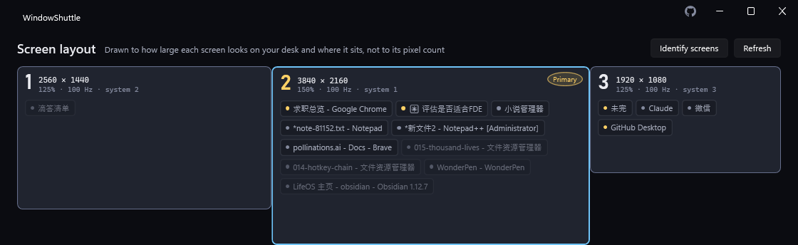

# WindowShuttle

> Swap window contents between monitors with a hotkey

[⬇ Download for Windows](https://github.com/rockbenben/WindowShuttle/releases/latest) · [简体中文](README.zh.md)

[](LICENSE) [](https://github.com/rockbenben/365opensource)



**Press a hotkey, and every window on the screen you're working on swaps places with every window on the primary monitor** — sizes and positions rescale to fit, so a window coming from a 150%-DPI display lands at a sane size on a 100% one instead of just being teleported pixel-for-pixel. WindowShuttle lives in the tray; there's nothing to configure to get the core swap working.

- A single portable exe — no installer, no account, nothing phoned home.
- **Hold `Ctrl` + right button and flick toward a screen** — the window under the cursor moves there. No screen numbers to remember; you flick the way you're already pointing. Misflicked? `Ctrl` + middle-click takes it back.
- Seven kinds of window-moving action, all reachable from the tray menu and the CLI.
- The map at the top of the main window is drawn from where your monitors actually sit, and you can work in it directly: drag a window from the map onto another monitor's card to send it there.
- Windows only (it moves real HWNDs with `SetWindowPos`/`DeferWindowPos`); mixed-DPI multi-monitor setups are the main use case, not an edge case.

## Does it fit your setup

| Area | Support |
|---|---|
| **Windows** | 10 or 11 |
| **Architecture** | x64. Only x64 builds are published — there is no native ARM64 one |
| **.NET** | Not needed for the standalone build; the smaller one wants the [.NET 10 desktop runtime](https://dotnet.microsoft.com/download/dotnet/10.0) |
| **Monitors** | Two or more. On a single screen every action answers *Only one screen* and moves nothing |
| **Mixed DPI / resolutions** | Supported, and the point of the thing: geometry is rescaled for the target screen instead of copied pixel-for-pixel |
| **Admin-owned windows** | Need WindowShuttle itself to run elevated — see [Known limitations](#known-limitations) |

## Download

**[⬇ Get the latest release](https://github.com/rockbenben/WindowShuttle/releases/latest)** — Windows x64.

- **`WindowShuttle-<version>-win-x64.zip`** — standalone; nothing else required. Unzip and run. Take this if you're unsure.
- **`WindowShuttle-<version>-win-x64-needs-dotnet10.zip`** — the same app without the bundled runtime; requires the [.NET 10 desktop runtime](https://dotnet.microsoft.com/download/dotnet/10.0) already installed on the machine. Much the smaller download; the release page prints both sizes.
- **`WindowShuttle.exe`** — that same build as the zip above, with no zip around it: click, run, or drop it over your existing copy to update. Windows offers the runtime download if it is missing.

All three unpack to (or already are) the same single-file `WindowShuttle.exe` — no installer, no account. The only difference is startup cost: the standalone exe unpacks itself to a temp folder on every launch, which costs it roughly 200ms more than the runtime-installed build on a one-shot CLI call like `list`. That gap doesn't touch the resident tray app or hotkey response — it's paid once at launch either way, not on every swap.

The exe isn't code-signed, so Windows SmartScreen warns on first run: click **More info → Run anyway**.

**Removing it.** There is no installer, so there is nothing to uninstall — with one exception: if you ever ticked *As administrator*, WindowShuttle registered a **scheduled task**, and deleting the exe would leave that task behind, pointing every logon at a file that no longer exists. Untick *Start with Windows* first — that clears both the task and the registry entry — then delete the exe. Settings live in `%APPDATA%\WindowShuttle` and can go with it.

## The seven actions

All seven are in the tray menu and the CLI. Two ship with a keyboard shortcut and four with a mouse gesture:

Below, "the window" means **whatever your hand is on**: a mouse gesture acts on the window under the pointer (as of the moment you pressed), while the keyboard, the tray menu and the CLI all act on the **current foreground window** (see [Known limitations](#known-limitations) for why the two differ).

| Action | Shortcut | Mouse gesture | What it does |
|---|---|---|---|
| Swap screens | `Ctrl+Alt+1` | `Alt` + middle-click | Swap every window between that screen and the primary; when it is already the primary, it swaps with the screen you last swapped with |
| Swap front windows | *(unbound)* | `Alt` + right-click | Swap just the frontmost window of each of those two monitors |
| Send to primary | *(unbound)* | *(unbound)* | Send that window to the primary monitor and raise it |
| Send to next monitor | *(unbound)* | *(unbound)* | Send that window to the monitor on its right, wrapping to the leftmost, and raise it |
| Send by direction | *(not applicable)* | **`Ctrl` + right, flick** | Flick toward a screen and the window under the cursor goes there — no screen number to think about first. See [Mouse gestures](#mouse-gestures) |
| Gather all | *(unbound)* | *(unbound)* | Gather every window back to the primary monitor, including ones stranded off-screen after unplugging a display |
| Undo | `Ctrl+Alt+2` | `Ctrl` + middle-click | Restore the positions from before the last move |

There is also one tool that moves nothing: **Identify screens**, the button next to *Refresh* above the map. Press it and each screen flashes its own number in the middle — that's how you check that the arrangement Windows believes in matches the one on your desk. It takes no shortcut or gesture slot (it isn't a window-moving action); the tray menu and the `identify` command trigger it too.

**Why only two hotkeys are bound out of the box, on purpose:** a global hotkey takes that combination away from *every* application on the desktop, not just WindowShuttle. `Ctrl+Alt+<letter>` in particular collides with things like Word's insert-© and IntelliJ's Extract Constant. So WindowShuttle claims as little as it can get away with — `Swap` and `Undo`, because being unable to undo a bad move is the worst first impression a window-moving tool can make — and leaves the rest for you to bind yourself. Every action in the main window has a shortcut slot showing one of three states: bound (normal), unbound (gray placeholder text, not an error), or conflict (red border + tooltip, when another program already holds that combination). To release a bound hotkey, click its row and press **Delete** or **Backspace** — it clears back to unbound, saved immediately, no editing `settings.json` by hand required.

### Mouse gestures

Your hand is already on the mouse, so four gestures ship bound. Every action has a gesture slot next to its shortcut slot in the main window — click it and perform the gesture to record, `Delete` to clear.

| Modifier | Right button — this one window | Middle button — a pile of windows |
|---|---|---|
| **`Ctrl`** — move this one | **Send by direction** | Undo |
| **`Alt`** — swap both ways | Swap front windows | Swap screens |
| **`Shift`** — left clear | *(empty)* | *(empty)* |

**The best cell goes to send-by-direction**, because it is the one you reach for all day: point at a window, flick toward the screen you want, done. Of the three modifiers, `Ctrl` + right takes the least away — `Shift` + right is Explorer's "copy as path" extended menu, `Alt` + right is AltSnap's default resize gesture, and `Ctrl` + right has no widely-honoured meaning to collide with.

**Undo sits right beside it, on the same modifier.** Move windows by flicking and you will misflick sooner or later; having to reach for the keyboard at that moment breaks the whole flow. So the `Ctrl` row reads "I am moving windows" — right sends it away, middle takes it back.

Two clues instead of four facts. **The button says how much**: right sits under your finger and acts on the one window beneath the cursor; middle takes a deliberate press and moves a pile at once — that holds for the whole middle column (undo usually takes back exactly the kind of bulk move the middle column makes), so every action whose misfire costs the most is behind the button you have to press on purpose. **The modifier says what**: `Ctrl` moves or takes back, `Alt` exchanges — one window and whole screen versions of the same idea.

**The `Shift` row is left clear**, both for you and for Explorer and your browser: `Shift` + right-click (that extended menu) and `Shift` + middle-click (open a tab in the foreground) are things people use every day, so the defaults stay off them. When you want gestures of your own, that row is already free.

**Send to primary, Gather all and Send to next monitor ship without a gesture** — not because they are weak, but because there is already a way: send-to-primary is a flick toward the primary; gather-all's main job (windows stranded off-screen after unplugging a display) is handled by the automatic rescue, with the manual one as a backstop; send-to-next is a flick to the right. All three are in the tray menu and the CLI, and recording a gesture for one is a single click. Binding one more cell costs another combination taken from other programs, and buys a path you already had.

#### `Ctrl` + right, flick

**Hold `Ctrl` and the right button, flick toward the screen you want, let go.** The window under the cursor goes there. No need to work out which number that screen is — you're already pointing at it. Misflicked? `Ctrl` + middle-click puts it back, without your hand leaving the mouse.

- **How far counts as a flick**: 40 pixels. Anything shorter isn't a direction — the bubble tells you to flick somewhere, and the click is replayed as-is.
- **Direction is the angle of the whole stroke, split at 45°, diagonals counting as horizontal.** It takes the farthest the stroke ever reached on each axis: within 45° of horizontal counts as left/right, steeper counts as up/down — an exact diagonal goes to left/right, the overwhelmingly common direction on a row of monitors. The whole stroke is measured, not the release point: a fast lateral flick always carries a downward tail, and judging by where you let go misreads a crisp sideways flick as vertical (caught in real use). Swinging out and back still counts — the distance you reached sideways doesn't vanish because you came back.
- **Flicking across a screen edge is fine**: what moves is always the window you were pointing at **when you pressed**, no matter which screen you release on — flicking toward the screen on the right naturally ends up on it.
- **The edges wrap around**: flick right on the rightmost screen and the window cycles to the leftmost one — the same convention as *Send to next monitor* wrapping at the end. It only wraps along the same axis: flick up on a row of monitors and there genuinely is no screen that way, so it still says so.
- **Change your mind mid-flick**: click the left button and the whole thing is cancelled — no window moved, no menu opened.
- **A snapped window stays snapped.** A window snapped to the left half lands on the **left half** of the screen you flick it to — quarters, top/bottom halves and vertical thirds likewise — instead of being proportionally scaled into a free-floating "roughly half" window. Detection is geometric (the window occupies a snap slot of its screen's work area); Windows' internal snap-group bookkeeping is out of reach for any third party, but the layout your eyes see survives the move.

**Why not the bare right button.** That is the usual shape for gesture software, and it does work here — measured, not assumed: a purpose-built Win32 window logging the messages it actually receives (Win11's menus are XAML, so counting popup windows proves nothing) produced the full `WM_RBUTTONDOWN` -> `WM_RBUTTONUP` -> `WM_CONTEXTMENU` both with and without WindowShuttle running, landing pixel-for-pixel on the press point. It isn't the default because the stakes are lopsided: what you save is one modifier key, what you bet is the system-wide context menu. If the replay fails on some machine — another low-level hook eats it, some program only honours real input — the user loses right-click menus everywhere and will not think to blame a window-moving utility. The capability is still there for anyone who wants it: record that slot as a bare right button (it is allowed for this action only).

The four that ship do take combinations away from other programs — `Ctrl` + middle-click is a browser's background tab, `Alt` + right-click is AltSnap. That is a deliberate trade, not an accident: WindowShuttle installs a global low-level mouse hook, so a bound gesture is intercepted before any application sees it — we always win. If you would rather keep `Ctrl`+middle-click for your browser, click that slot and press **Delete**; it is one keystroke.

Left alone on purpose: **bare buttons — none are used out of the box** (see the section above); and the side buttons, which many mice do not have, so they stay out of the defaults and are yours to record. **Treat the Windows key as unavailable** — Windows reclaims that key before the click reaches any application; measured on the author's machine, at the moment of the click it reads as not held. That is why the recording prompt names only `Ctrl` / `Alt` / `Shift`: a press with no readable modifier is dropped and no binding is stored. Note the app does **not** pop a card explaining this — what needed saying is in the prompt, before you act.

`RegisterHotKey` can't bind mouse buttons, so these run through a global low-level mouse hook — a mechanically stricter case than a hotkey. A hotkey's registration succeeds or fails on the spot, which is why a taken combination shows up red; a mouse hook has no such signal. Windows never tells WindowShuttle "this gesture is already claimed," so a gesture can silently collide with another program with neither side noticing. The app says this next to the gesture slots, not just here. One confirmed collision: `Alt` + right-click is AltSnap's default window-resize gesture — clear that slot if you run AltSnap.

**Bind no gestures at all and the hook does not exist in the process** — not "installed but idle". Clear all four slots with `Delete` and WindowShuttle leaves the mouse-input path entirely, leaving keyboard shortcuts, the tray menu and the CLI. The hook itself runs on its own dedicated thread and does one thing — decide whether it recognises the combination — before returning; the actual window moving happens on another thread. Windows gives each hook on that chain only 300ms, and going over it stalls clicks system-wide, so nothing blocking is ever put on that thread. Worth knowing: if you run AutoHotkey, Logitech Options+, PowerToys or similar, they sit on the same chain. Whichever link gets slow, the symptom is the same — a sluggish pointer and clicks that occasionally stick — so disabling them one at a time is the way to find it.

## Settings

The bar along the bottom of the main window. Defaults in brackets:

- **Skip fullscreen apps** *(on)* — a window that exactly fills a monitor with no title bar or thick border is left alone. This applies to every action.
- **Rescue off-screen windows when a monitor disconnects** *(**off**)* — turn it on and, about two seconds after you unplug a display, any window left completely outside every remaining screen is pulled back to the primary.

  It is off by default because **Windows already moves windows off a display you disconnect** — the main case is covered. What is left is the residue: a minimized window restored to a remembered off-screen rect, an app that starts up at its own saved coordinates, a window still sitting where it was after a resolution drop. Paying for that residue with *moving your windows when you pressed nothing* should not be everyone's default. Turn it on if you hit it; *Gather all* does the same thing on demand any time.

  It only touches windows with zero overlap with any monitor, so anything you can still see stays put, and it deliberately does **not** take the undo slot: undo still steps back the last move *you* made.
- **Keep running in the tray when closed** *(on)* — the close button hides the window instead of exiting. Turn it off and closing the window quits.
- **Start with Windows** *(**on**)* — a tray-resident tool that doesn't start with the machine loses half its point. The plain tier is a `HKCU\...\Run` entry passing `--tray`, so the boot launch goes straight to the tray without putting a window in your face; launching the exe yourself opens the main window.
- **As administrator** *(off; under Start with Windows)* — swaps the registry entry for a **Run-with-highest-privileges scheduled task**: one UAC prompt when you tick it, then every boot starts silently elevated.

  This is the only complete fix for the two elevated-window limitations (their windows can't be moved, and gestures go dead while one holds the foreground — which in daily use looks like "my flick suddenly turned into a right-drag/copy"). Every bypass we measured, including handing the move to Windows' own `Win+Shift` keys, dies on UIPI. **The first launch does not ask for this** — it only turns on plain autostart. Elevation buys exactly those two things, and if you never hit them you never need it; the app speaks up when you do — the toast shown when a move is refused and the one shown when gestures go dead both offer to restart elevated, and *Restart as administrator* sits in the tray menu. Tick the box to make it permanent; unticking deletes the task (one more UAC). While resident elevated, the CLI from a non-elevated terminal keeps working (the message filter allows it).

## CLI

`WindowShuttle.exe <command>` — output and errors are always in English, regardless of the UI language, so scripts can parse them reliably:

| Command | Effect |
|---|---|
| `swap [--to <n>]` | Swap screens (optionally targeting monitor `<n>` instead of the primary; if the current window is already on screen `<n>` it reports "already on the target screen" and exits `1`) |
| `swap-top` | Swap front windows |
| `to-primary` | Send to primary |
| `to-next [--to <n>]` | Send to the monitor on the right, wrapping to the leftmost (or straight to monitor `<n>`) |
| `gather` | Gather all |
| `undo` | Undo |
| `identify` | Flash each screen's number |
| `list` | Print monitors and movable windows as JSON (every window carries `position`, the same numbering `--to <n>` takes). *Movable* means the same thing here as everywhere else in the app: windows that are not responding are left out, and so are fullscreen ones while *Skip fullscreen apps* is on — so a window absent from this list is a window no command would have moved either |

**There is one screen numbering in this app: position, counted left to right** (then top to bottom within a column), 1-based. It is what the map prints, what *Identify screens* flashes (the button next to Refresh), what `--to <n>` takes, and what `list` reports as `position`.

It is **not** the number in Windows display settings. That one has no relation to where a screen sits — put a second screen left of your primary and the primary is still number 1 while sitting in the middle — and it can be reshuffled by changing ports, docking, or reinstalling a GPU driver, which would silently repoint a binding at a different screen. The Windows number isn't lost: the map card's small print shows `system N`, and `list` still carries `index` and `device` for reconciling with the OS.

Sending a window straight to one particular screen is reachable from a script as `to-next --to <n>`; it shares this command rather than adding a redundant verb. *Send by direction* has no CLI verb of its own — "which way did you flick" has no command-line counterpart, and a `--direction left` would just be `--to <n>` under another name.

Exit codes: `0` done, `1` nothing to do, `2` some windows failed to move (see [Known limitations](#known-limitations)), `3` error (bad arguments, a `--to` position that doesn't exist, etc.).

The CLI follows the same rule as the keyboard: it acts on **the current foreground window**. Run `to-primary` from a terminal and the terminal window is what moves — far more predictable for a script than "wherever the mouse happens to be parked".

If WindowShuttle is already resident in the tray, running a CLI command relays it to that instance and exits with its result — hotkeys, tray menu, and CLI all share the same undo stack. If nothing is resident, the command runs once, standalone, and exits without leaving anything in the tray. `list` is the exception: it always answers directly from the invoking process, read-only, no IPC.

## Known limitations

- **Windows belonging to elevated (administrator) programs can't be moved.** A non-elevated process can't reposition a higher-integrity window — Windows blocks it (UIPI), not a WindowShuttle bug. WindowShuttle counts how many windows this happened to and offers to restart itself elevated — click the tray balloon, confirm the prompt, and it relaunches with admin rights. This is a real, visible behavior: on the author's daily desktop, 6 of 27 open windows hit it on an average swap.
- **Gestures stop working entirely while an elevated program has focus.** When the foreground window belongs to a program running as administrator, Windows stops delivering mouse events to a normal-privilege global hook like ours — **regardless of which screen the cursor is on or which window you click**. Every gesture goes silent together. Focus any ordinary window (one click elsewhere) and it recovers immediately; no restart needed. Measured: with an ordinary window focused, 6 of 6 gestures landed; with an elevated window focused, 0 of 5 landed on ordinary windows.

  **WindowShuttle tells you about this itself**, but only while you are actually using gestures: if you triggered a mouse gesture within the last three minutes and an elevated program then takes and holds the foreground, an actionable card appears; clicking it takes the *Restart as administrator* route.

  The condition is "you are using gestures", not "the foreground changed". The version that only watched the foreground tested badly: doing nothing but clicking into a password manager produced an unsolicited offer to restart as administrator, for a window you never meant to move. The information is useful at exactly one moment — you were just flicking windows and have now walked into the dead zone. So someone who never uses gestures never sees the card, and someone who used one in the morning is not reminded of it in the afternoon.

  Keyboard shortcuts are completely unaffected (`RegisterHotKey`, a different path), which makes them the fastest diagnosis: **gestures dead but shortcuts fine = something elevated has focus**. The only way to remove the limitation is to run WindowShuttle elevated too — the tray menu has *Restart as administrator*. That is also the only way the elevated windows themselves become movable, since `SetWindowPos` is refused at normal privilege as well.
- **Once in a while a gesture comes out as a plain right-click.** The modifier has to be held *at the instant the button goes down* — that is when the decision to swallow the click or let it through must be made. If `Ctrl` lands even a few milliseconds late, that press matches nothing, passes straight through to the app underneath, and you get a context menu instead of a window flying across.

  This is not a tolerance that can be widened: by the time the drag reveals what you meant, the button-down has already been delivered. And keyboards are inherently slower to report than mice — matrix scan plus debounce, and a typical 125 Hz USB polling rate (one report per 8 ms) against a mouse's 1000 Hz — so even a genuinely simultaneous press usually reaches the system mouse-first. Measured here: in one real failure the button-down arrived with `Ctrl` still not registered, and that press dragged 721 px, so it was unmistakably a gesture.

  Two ways around it: **hold `Ctrl` down** across a run of flicks (only the first one can race), or bind the action to a **bare side button** (`X1`/`X2`) — no modifier, no race, and a press without a flick is replayed verbatim so the button's usual Back still works.

- **Which window moves depends on which hand you used.** Mouse gestures act on the window **under the cursor** — the one you were pointing at when you pressed (and for a flick across a screen edge, still the one under the *press* point). Keyboard shortcuts, the tray menu and the CLI act on the **focused window**.

  These are not two rules but one: the referent should be whatever you are pointing at right now. With your hand on the mouse the pointer *is* the pointing device, and using focus instead would mean pointing at a browser and watching your editor fly away. With your hand on the keyboard the pointer is parked wherever you last left it — possibly on another screen, over another window — and reading it as intent reads an unrelated leftover. Windows' own `Win+Shift+←/→` and PowerToys FancyZones both act on focus for the keyboard.

  Neither path ever reaches past its target. For gestures: if the topmost window under the cursor can't be moved (WindowShuttle's own window, a fullscreen app being skipped, a hung window), nothing happens and the bubble says there is no window under the cursor — it will not move whatever is hidden behind it. The keyboard path is the same: if the focused window can't be moved, the bubble says so rather than quietly moving something else. Moving a window you never pointed at is worse than doing nothing.
- **Modal dialogs owned by another window are not moved.** v1 only moves top-level windows (the ones you'd see in Alt+Tab); a dialog attached to a window that gets swapped stays behind on the old monitor.
- **Undo is a single step.** WindowShuttle keeps exactly one snapshot: the positions from before the last move *you* made. Pressing undo twice returns you to where you were rather than stepping further back. The automatic off-screen rescue deliberately does not overwrite that snapshot, so unplugging a monitor never costs you the undo you were about to press.
- **Fullscreen applications are skipped by default** (a window that exactly fills a monitor with no title bar or thick border — games, video players). Turn off "Skip fullscreen apps" at the bottom of the main window to include them.
- **Windows that aren't responding are skipped, and WindowShuttle says so** — the tray balloon and the CLI result line both report a "skipped N not-responding window(s)" count, the same way they already report skipped fullscreen apps.
- **Windows on another virtual desktop are invisible to WindowShuttle, on purpose.** Windows marks a window as "cloaked" while its virtual desktop isn't the active one — the same flag used for suspended UWP apps — and WindowShuttle treats cloaked windows as not there, so they're excluded from every action, including `list`. This is deliberate, not a bug: `gather` reaching across desktops to yank a window onto your current screen would be more surprising than just leaving it where it is. Switch to that virtual desktop first if you want to move something on it.

## Languages

18 languages — English, 简体中文, 繁體中文, 日本語, 한국어, Español, Français, Deutsch, Italiano, Português, Русский, العربية, हिन्दी, Bahasa Indonesia, Tiếng Việt, ไทย, Türkçe, Nederlands — following the system language by default. Switch it at the bottom of the main window — the change takes effect after a restart (WindowShuttle prompts you).

## Build from source

Requires the .NET 10 SDK. Windows only.

```bash
dotnet build WindowShuttle.sln -c Debug
dotnet test  tests/WindowShuttle.Core.Tests
dotnet run   --project src/WindowShuttle.App
```

Two self-check switches are built into the exe. Both run before the single-instance check, so they never disturb an instance already sitting in your tray, and neither one touches your `settings.json`:

```bash
WindowShuttle.exe --smoke              # construct and lay out every window, then exit
WindowShuttle.exe --shots <directory>  # render every window to PNG: 2 themes x 5 languages (incl. RTL Arabic) x 7 real screen sizes
```

`--smoke` reports through a marker file at `%TEMP%\windowshuttle-smoke.txt` (`OK`, or the exception) rather than an exit code. Why each switch exists is documented in `src/WindowShuttle.App/App.SelfCheck.cs`.

Publish a single-file build (win-x64):

```bash
dotnet publish src/WindowShuttle.App -c Release -p:PublishProfile=win-x64              # standalone, no runtime required
dotnet publish src/WindowShuttle.App -c Release -p:PublishProfile=win-x64-needs-dotnet10  # small, needs the .NET 10 desktop runtime
```

Every push runs the tests, both self-check switches and the CLI exit codes. Pushing a `v*` tag additionally publishes both builds, writes `SHA256SUMS.txt` and attaches a build-provenance attestation, so a downloaded asset can be checked with `gh attestation verify <file> -R rockbenben/WindowShuttle` rather than trusting a checksum that sits on the same page as the file it vouches for.

What no runner can reach — a real UAC prompt, physically unplugging a display, gestures while an elevated window holds the foreground, a key press that synthetic input reports differently from a real finger, and anything judged by eye — is in [`docs/manual-checks.md`](docs/manual-checks.md), grouped by *why* each one needs hands. Walk it before tagging.

## About the 365 Open Source Plan

Project **#033** of the [365 Open Source Plan](https://github.com/rockbenben/365opensource) — one person + AI, 300+ open-source projects in a year.

[Submit your idea →](https://365.aishort.top/) · [Discord](https://discord.gg/PZTQfJ4GjX) · [Telegram](https://t.me/aishort_top)
