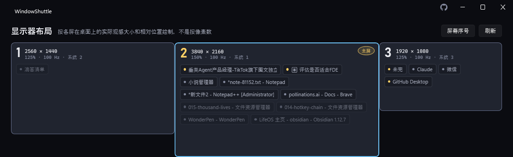

# WindowShuttle

> 按热键把鼠标所在屏与主屏的窗口整块对调

[⬇ 下载 Windows 版](https://github.com/rockbenben/WindowShuttle/releases/latest) · [English](README.md)

[](LICENSE) [](https://github.com/rockbenben/365opensource)



**按一下热键，你正在用的那块屏上的所有窗口，就和主屏上的所有窗口整体互换位置** ——大小和位置会按目标屏重新计算，所以从 150% 缩放的屏换到 100% 缩放的屏上，窗口落地时是个合理的尺寸，不是原样像素对调过去就完事。WindowShuttle 常驻托盘，装上就能用，核心的整屏互换不需要任何配置。

- 单文件绿色版，无需安装、无需账号、不联网。
- **按住 `Ctrl` 右键往某个方向划一下**，鼠标下的窗口就搬到那个方向的屏上——不用记屏号，往哪比划就去哪；划错了 `Ctrl`+中键 收回来。
- 七种搬窗动作，托盘菜单和命令行都能触达。
- 主窗口上半那张图是按显示器实际摆放位置画的，也能直接操作：把某扇窗从图上拖到另一块屏的卡片上，那扇窗就搬过去。
- 仅支持 Windows（靠 `SetWindowPos`/`DeferWindowPos` 直接搬 HWND）；混合 DPI 的多屏环境是主场景，不是边缘情况。

## 它认不认你的机器

| 方面 | 支持情况 |
|---|---|
| **系统** | Windows 10 或 11 |
| **架构** | x64。只发布 x64 构建，没有原生 ARM64 版 |
| **.NET** | 绿色版不需要；精简版需要装 [.NET 10 桌面运行时](https://dotnet.microsoft.com/download/dotnet/10.0) |
| **显示器** | 两块及以上。单屏时每个动作都会明确答「只有一块显示器」，什么都不搬 |
| **混合 DPI / 分辨率** | 支持，而且正是它要解决的事：几何按目标屏重算，不是逐像素照搬 |
| **管理员程序的窗口** | 要让 WindowShuttle 自己也提权运行才搬得动，见[已知限制](#已知限制) |

## 下载

**[⬇ 下载最新版](https://github.com/rockbenben/WindowShuttle/releases/latest)** —— Windows x64。

- **`WindowShuttle-<版本>-win-x64.zip`** —— 绿色版，不需要额外装任何东西，解压即用。拿不准就下这个。
- **`WindowShuttle-<版本>-win-x64-needs-dotnet10.zip`** —— 同一个程序，只是不带运行时；需要机器上已经装好 [.NET 10 桌面运行时](https://dotnet.microsoft.com/download/dotnet/10.0)。体积小得多，具体多少发布页上有。
- **`WindowShuttle.exe`** —— 就是上面那个不含运行时的版本，只是没套 zip：点开即用，也可以直接盖掉现有的那份完成更新。缺运行时时 Windows 会自己提示下载。

三个拿到手都是同一个单文件 `WindowShuttle.exe`，免安装、无需注册。唯一的区别在启动开销：绿色版每次启动都要先把自己解包到临时目录，命令行一次性调用（比如 `list`）会因此比装了运行时的版本多花约 200ms。这个差距只体现在一次性命令行调用上——常驻托盘和热键响应不受影响，这笔开销只在启动那一刻付一次，不会体现在每次搬窗操作里。

程序没有代码签名，首次运行 Windows SmartScreen 会拦一下：点**更多信息 → 仍要运行**。

**不想要了怎么清干净。** 没有安装程序，本来也没什么可卸载的——只有一个例外：只要勾过「以管理员身份」，WindowShuttle 就登记过一条**计划任务**；这时候直接删掉 exe，那条任务会留在系统里，每次登录都指向一个已经不存在的文件。**先取消「开机自启」**——它会把计划任务和注册表项一起清掉——再删 exe。配置在 `%APPDATA%\WindowShuttle`，一并删掉即可。

## 七种动作

七种动作都在托盘菜单和命令行里；出厂绑了两个键盘快捷键、四个鼠标手势：

下表里的「窗口」按**你用哪只手**解释：鼠标手势认光标指着的那一扇（按**按下**那一刻算），快捷键、托盘菜单、命令行一律认**当前窗口**（前台/焦点窗口）——两者为什么不同，见[已知限制](#已知限制)。

| 动作 | 快捷键 | 鼠标手势 | 作用 |
|---|---|---|---|
| 整屏互换 | `Ctrl+Alt+1` | `Alt`+中键 | 那一扇窗所在屏与主屏之间，所有窗口整体对调；它本来就在主屏上时，换的是上次对调过的那块屏 |
| 对调最前窗口 | *（未绑定）* | `Alt`+右键 | 只对调这两块屏各自最前面的那一个窗口 |
| 送去主屏 | *（未绑定）* | *（未绑定）* | 把那一扇窗送到主屏，并提到最前 |
| 送去下一块屏 | *（未绑定）* | *（未绑定）* | 把那一扇窗送往右边那块屏，到头绕回最左，并提到最前 |
| 按方向送屏 | *（不适用）* | **`Ctrl`+右键划一下** | 往哪个方向划，鼠标下的窗口就搬到那个方向的屏上。不用先想"那是第几块屏"，见[鼠标手势](#鼠标手势) |
| 全部收拢 | *（未绑定）* | *（未绑定）* | 所有窗口收拢回主屏，包括拔掉显示器后流落屏外的窗口 |
| 撤销 | `Ctrl+Alt+2` | `Ctrl`+中键 | 恢复上一次搬运前的位置 |

还有一个不搬窗口的小工具：**屏幕序号**，在地图右上角「刷新」旁边。按一下，每块屏中央闪一次自己的序号——用来核对 Windows 认定的屏幕排列跟你桌上的实际摆位是否一致。它不占快捷键位和手势位（不是搬窗动作），托盘菜单和 `identify` 命令也能触发。

**为什么默认只绑两个热键，这是故意的：** 一个全局热键，会从桌面上**所有**应用手里夺走这个组合键，不只是 WindowShuttle 自己用不到。`Ctrl+Alt+<字母>` 尤其容易撞车——Word 的插入版权符号 ©、IntelliJ 的 Extract Constant 都在这个命名空间里，绑了就等于让它们静默失效。所以 WindowShuttle 尽量少圈地：只默认绑 `整屏互换` 和 `撤销`——搬错了却退不回去，是一个搬窗工具能给用户的最差第一印象。其余的留给你自己录制。主窗口里每个动作都有一个快捷键位，三种状态：已绑定（正常显示）、未绑定（灰色占位文字，不是错误）、冲突（红框 + 悬浮提示，表示这个组合键已经被别的程序占了）。想释放一个已绑定的热键，点中那一行按 **Delete** 或 **Backspace** 即可清空回未绑定状态，立即保存生效，不需要手改 `settings.json`。

### 鼠标手势

手本来就在鼠标上，所以出厂就绑了四个手势。主窗口里每个动作的快捷键位旁边都有一个手势位，点一下做出手势即可录制，`Delete` 清除。

| 修饰键 | 右键 — 这一扇窗 | 中键 — 一次动一堆窗 |
|---|---|---|
| **`Ctrl`** — 搬这一下 | **按方向送屏** | 撤销 |
| **`Alt`** — 两边对调 | 对调最前窗口 | 整屏互换 |
| **`Shift`** — 留白 | *(空)* | *(空)* |

**最好的那一格给了按方向送屏**，因为它是日常用得最多的一个动作：指着一扇窗，往目标屏的方向划一下就完事。三个修饰键里 `Ctrl`+右键 抢走的东西最少——`Shift`+右键 是资源管理器「复制为路径」那套扩展菜单，`Alt`+右键 是 AltSnap 的默认缩放手势，而 `Ctrl`+右键 没有对得上号的通用约定。

**撤销就挨着它，同一个修饰键。** 用划的搬窗，迟早会划错一次；那一刻还要伸手去够键盘的话，整个流程就断了。所以 `Ctrl` 这一行读作「我正在搬窗户」——右键搬出去，中键收回来。

要记的是两条线索，不是四件事。**按钮说「管多少」**：右键在手指下面，管光标下那一扇窗；中键要专门按一下，一次动一堆——中键那一列全都如此（撤销退的往往正是整屏互换那种大动作），所以误触代价最大的动作全都落在必须专门按一下的键上。**修饰键说「做什么」**：`Ctrl` 是搬 / 收回来，`Alt` 是两边对调，一扇窗和整屏两个版本。

**`Shift` 整行留白**，既是给你的，也是给资源管理器和浏览器的：`Shift`+右键（复制为路径那套扩展菜单）和 `Shift`+中键（浏览器前台开标签页）都是有人天天在用的东西，出厂不去动。想加自己的手势，这一行是现成的干净格子。

**`送去主屏` / `全部收拢` / `送去下一块屏` 出厂不给手势**——不是它们不好用，是已经有别的路了：`送去主屏` 就是往主屏那个方向划一下；`全部收拢` 的主战场（拔屏之后窗口流落到屏外）默认由自动救援接管，手动那次是兜底；`送去下一块屏` 就是往右划。三个都在托盘菜单和命令行里，想要手势自己录一格，一次点击的事。多绑一格的代价是从别的程序手里再拿走一个组合，而换来的是一条已经有的路。

#### 按住 `Ctrl`+右键划一下

**按住 `Ctrl` 和右键，往目标屏的方向划一下，松手**，鼠标下的窗口就搬过去了。不用先想那是第几块屏——你已经在朝它比划了。划错了按 `Ctrl`+中键 收回来，手不用离开鼠标。

- **多长算划出去**：40 像素。比这短就不算方向，气泡会提示你得划出一个方向来，那次点击也原样还给应用。
- **方向按整条划动的角度判，45° 分界，斜线归左右。** 取划动在横竖两个方向各自到达过的最大幅度：与水平的夹角不超过 45° 就算左右，更陡才算上下——正好 45° 的对角线也归左右（横排屏幕上这是压倒性常用的方向）。量的是整条划动而不是松手那一点：快速横甩总带着往下收的尾巴，按松手位置判会把干脆的横甩读成竖划（实测抓到过）。甩出去又收回来也照样算数——横向到达过的幅度不会因为收回来而消失。
- **跨屏划动没问题**：搬的始终是你**按下时**指着的那一扇窗，跟松手时光标落在哪块屏无关——往右边那块屏划，本来就会划到那块屏上去。
- **到头绕圈**：在最右那块屏上还往右划，窗口绕到同一排最左那块——跟「送去下一块屏」走到头绕回最左是同一个约定。只在同一条轴上绕：并排的桌面往上划，上面真的没有屏，照样报「那边没有屏幕」。
- **半路反悔**：按一下左键，整个取消——不搬窗口，也不弹菜单。
- **贴边分屏的窗口，搬过去还是分屏。** 贴在左半屏的窗口划到另一块屏后落在那块屏的**左半**，四角、上下半、竖三分同理——不会被等比缩放成一扇"大约一半"的浮动窗。识别是按几何做的（窗口正好占着某个贴边位就算），Windows 内部的 Snap 分组关系我们碰不到，但你眼睛看到的布局保住了。

**为什么不用裸右键。** 裸右键才是手势类软件的通行形态，而且在作者机器上是验过能用的：判据取应用自己收到的消息，不是「屏幕上看着有没有菜单」——挂一扇自建 Win32 窗口读它 WndProc 里的 `WM_CONTEXTMENU`（Win11 的菜单是 XAML，数弹出窗口数不出来），对照组与实验组都得到完整的 `WM_RBUTTONDOWN → WM_RBUTTONUP → WM_CONTEXTMENU`，落点与按下点逐像素一致。不做默认是因为代价与收益不对等：省下的是一个修饰键，赌上的是全系统的右键菜单——补发那条路一旦在某台机器上不成立（另一个低级钩子把补发吞了、某个程序只认真实输入），用户失去的是所有程序的右键菜单，而他多半不会想到是这个搬窗小工具干的。想要的人自己把这一格录成裸右键即可，这个能力是留着的（也只对这一个动作留着）。

剩下这四格仍然是在抢东西——`Ctrl`+中键 是浏览器的后台开标签页，`Alt`+右键 是 AltSnap。这是明摆着的取舍，不是疏忽：WindowShuttle 装的是全局低级鼠标钩子，绑定的手势在任何应用看到之前就被拦下，**我们必然抢赢**。想把 `Ctrl`+中键 还给浏览器，点那一格按 **Delete** 即可，一次按键的事。

故意不碰的：**裸按键，出厂一个都不用**（理由在上一节）；侧键，很多鼠标没有，不进出厂默认，自己录随意。**`Win` 键请当它不可用**：Windows 会在点击到达任何应用之前把这个键收走，作者机器上实测，点击落地那一瞬读出来就是「没按」。录制态那行提示因此只点名 `Ctrl` / `Alt` / `Shift`——读不到修饰键的那次按下会被直接丢掉，不留下任何绑定。注意应用**不会**为此弹一张解释卡：该说的话在你动手之前就写在提示里了。

`RegisterHotKey` 绑不了鼠标按钮，这些走的是全局低级鼠标钩子——跟热键相比是机制上更严格的一种情形。热键的注册当场就能知道成功还是失败，撞车的组合才能被标红；鼠标钩子没有这种信号，Windows 从不会告诉 WindowShuttle「这个手势已经被占了」，一个手势可能和另一个程序悄悄冲突而双方都毫无察觉。应用在手势位旁边就写着这句话，不只写在这里。已确认的一个冲突：`Alt`+右键正是 AltSnap 默认的窗口缩放手势——你要是在用 AltSnap，把那一格清掉。

**一个手势都没绑，进程里就根本不存在这个钩子**——不是"装着但不触发"。把四格全按 `Delete` 清掉，WindowShuttle 就彻底退出鼠标输入这条路，只剩键盘快捷键、托盘菜单和命令行。钩子本身跑在自己的专用线程上，只做"这个组合认不认识"这一次判断就返回，真正搬窗口的活儿交给别的线程——鼠标输入这条路上系统只给每个钩子 300ms，超了全系统的点击都会被拖住，所以这条线程上不放任何会阻塞的事情。顺带一提，如果你在用 AutoHotkey、Logitech Options+、PowerToys 这类工具，它们各自也在这条链上；哪一环慢下来，症状都是"鼠标发涩、点击偶尔卡住"，排查时可以逐个停掉试。

## 设置

主窗口最底下那条设置栏，括号里是默认值：

- **跳过全屏应用**（开）——正好铺满某块屏、且没有标题栏/粗边框的窗口不动它。这道闸对**所有**动作生效。
- **拔屏后自动救回屏外窗口**（**关**）——打开后，拔掉一块显示器约两秒，完全落在所有屏幕之外的窗口会被拉回主屏。只碰跟所有屏零交叠的窗口，你还看得见的一律不动；而且它**不占**撤销位，撤销回退的仍然是**你**做的上一次搬运。

  默认关，因为 **Windows 自己就会在拔屏时把那块屏上的窗口挪到剩下的屏上**，主场景它已经接住了。这条只覆盖残余：最小化的窗口被还原到记住的那个屏外矩形、应用启动时按存档坐标摆回屏外、分辨率变小之后留在原坐标的窗口。用「在你没按任何键的情况下移动你的窗口」去换这点残余，不该是所有人的默认——撞上的人打开即可，`全部收拢` 也随时能按需干同一件事。
- **关闭后留在托盘运行**（开）——关闭按钮只是隐藏窗口。关掉这项，点关闭就是退出。
- **开机自启**（**开**）——常驻型工具不自启等于每次开机都少一半功能。普通档就是一条 `HKCU\...\Run` 注册表项，带 `--tray`，开机直接进托盘、不糊你一脸窗口；你自己双击 exe 则正常打开主窗口。
- **以管理员身份**（默认关，挂在「开机自启」下）——把自启从注册表项换成一条 **Run with highest privileges 的计划任务**：勾选时过一次 UAC，之后每次开机都静默以管理员身份启动，不再有任何提示。

  这是管理员窗口那两条限制（搬不动它们的窗口、它们占前台时手势整体失灵——后者的日常表现是「手势忽然变成了右键拖拽/复制」）的**唯一完整解**——我们实测过所有旁路，包括把搬运交给系统的 `Win+Shift` 键，全部在 UIPI 上撞死。提权运行之后两堵墙一起消失。

  **首次启动不会问这件事**——它只打开普通自启。提权买到的就是上面那两条，撞不到就用不着；真撞上时应用会自己说：搬不动时那张气泡、手势整体失效时那张提示卡，都能点着去「以管理员身份重启」，托盘菜单里也常驻这一项。想让它长期生效，再来勾这一格；取消勾选会删掉那条任务（也要过一次 UAC）。提权驻留时，普通权限终端里的命令行照常工作（消息过滤器已放行）。

## 命令行

`WindowShuttle.exe <command>` —— 输出和报错恒为英文，不跟随界面语言，脚本可以稳定解析：

| 命令 | 作用 |
|---|---|
| `swap [--to <n>]` | 整屏互换（可用 `--to <n>` 指定目标屏，而不是默认的主屏；当前窗口已经在第 `<n>` 块屏上时报「窗口已在目标屏上」、退出码 `1`） |
| `swap-top` | 对调最前窗口 |
| `to-primary` | 送去主屏 |
| `to-next [--to <n>]` | 送去右边那块屏，到头绕回最左（带 `--to <n>` 时直送第 `<n>` 块屏） |
| `gather` | 全部收拢 |
| `undo` | 撤销 |
| `identify` | 屏幕序号：每块屏闪一次自己的序号 |
| `list` | 以 JSON 打印显示器与可搬运窗口列表（每扇窗都带 `position`，跟 `--to <n>` 同一套编号）。这里的**可搬运**跟应用别处同一个口径：无响应的窗口不在其中，开着「跳过全屏应用」时全屏窗口也不在——这份清单里没有的窗口，任何命令也一样搬不动它 |

**全应用只有一套屏号：屏幕的排列位次**，从左到右数（同一列再从上往下），1 起。地图上印的、`屏幕序号` 闪的、`--to <n>` 收的、`list` 里 `position` 字段报的，都是它。

它**不是** Windows 显示设置里那个编号。那个编号跟屏幕摆在哪儿没有关系（把副屏摆在主屏左边，主屏仍是 1 号却排在中间），而且换端口、插拔坞站、重装显卡驱动之后可能重排——拿它当门牌号，绑好的键会在某天之后静默指向另一块屏。Windows 的编号没有丢：地图卡片上那行小字里写着「系统 N」，`list` 里也照旧有 `index` 和 `device`，需要跟系统对号时看它。

把窗口直送某一块指定的屏，在脚本里就是 `to-next --to <n>`，不另开一个同义的命令名。`按方向送屏` 只有鼠标手势这一个入口——"往哪边划"在命令行里没有对应物，硬造一个 `--direction left` 只是把 `--to <n>` 换个说法。

退出码：`0` 完成，`1` 无事可做，`2` 部分窗口搬运失败（见下方[已知限制](#已知限制)），`3` 出错（参数不合法、`--to` 指定的屏号不存在等）。

命令行跟快捷键同一套判据：**作用于当前的前台窗口**。在终端里跑 `to-primary`，搬的就是那个终端窗口——这比"取决于鼠标恰好停在哪"可预期得多，脚本里也更好推理。

如果 WindowShuttle 已经驻留在托盘里，命令行命令会转发给那个驻留实例执行，退出码也是它的执行结果——热键、托盘菜单、命令行三条入口共用同一份撤销栈。如果没有驻留实例，命令就在当前进程里一次性跑完、退出，不会额外常驻。`list` 是唯一例外：它永远由发起调用的进程自己直接回答，只读、不走 IPC。

## 已知限制

- **以管理员身份运行的程序，其窗口搬不动。** 非提权进程改不动完整性级别更高的窗口——这是 Windows 的 UIPI 设计，不是 WindowShuttle 的 bug。WindowShuttle 会数清楚这次操作里有几个窗口撞上了这一条，并在托盘气泡里提示——点击气泡、在确认框里同意，就会以管理员身份重启。这是真实存在、经常能看到的情况：在作者本人的日常桌面上，一次整屏互换里 27 个窗口有 6 个会撞上这条限制。
- **焦点停在管理员程序上时，鼠标手势整体失效。** 只要前台窗口属于一个以管理员身份运行的程序，Windows 就不再把任何鼠标事件送给我们这种普通权限的全局钩子——**跟你把光标放在哪块屏、点哪扇窗无关**，所有手势一起沉默。把焦点切到普通窗口（点一下别处即可）就立刻恢复，不需要重启。实测数据：前台是普通窗口时，连续 6 次手势 6 次命中；把一个管理员窗口切成前台之后，同样点普通窗口，5 次 0 命中。

  **WindowShuttle 会自己说这件事**，但只在你**正在用手势**的时候说：最近三分钟内真的触发过鼠标手势，而现在有个管理员程序占到前台并停住，才弹一张可点的提示卡，点它走「以管理员身份重启」那条路。

  条件是「你正在用手势」而不是「前台变了」——只判前台的那一版实测下来很糟：什么都没做、只是点进密码管理器停了一会儿，就收到一张「要不要以管理员身份重启」，而你压根没打算搬窗口。这条信息只在一个时刻有用：你刚才还在划，现在进了死区、再划就没反应了。所以从没用过手势的人一辈子看不到这张卡，早上用过、下午才点进管理员程序的人也不会被翻旧账。

  键盘快捷键完全不受影响（走 `RegisterHotKey`，另一条通路），所以这也是最快的自查办法：**手势没反应但快捷键正常 = 前台有个管理员程序**。想彻底消除只有一个办法：让 WindowShuttle 自己也以管理员身份运行，托盘菜单里有「以管理员身份重启」。顺带一提，那时候管理员窗口本身也才搬得动（普通权限下 `SetWindowPos` 一样会被拒）。
- **偶尔一次手势会变成普通右键单击。** 修饰键要在**按下鼠标那一瞬**就已经按住——判定必须发生在那一刻，因为那时就得决定"这一下吞不吞"。`Ctrl` 只要晚到几毫秒，这一下就匹配不上、原样落进底下的程序，你看到的是一个右键菜单而不是窗口飞过去。

  这不是可以调大的容差：等看到你拖动了再反悔已经来不及，按下早就送出去了。而键盘天生比鼠标慢报——矩阵扫描加去抖，USB 回报率常见 125Hz（8ms 一次），而鼠标常年 1000Hz（1ms 一次）——所以即便你觉得是同时按的，鼠标也大概率先到。实测确认过：一次真实失败里，右键按下时 `Ctrl` 确实还没到，而那一下拖了 721 像素，是货真价实的手势动作。

  两个办法：连着做手势时**按住 `Ctrl` 不放**（第二次起就不会再撞），或者把这个动作**录成不带修饰键的侧键**（`X1`/`X2`）——没有修饰键就没有这个时序问题，而且只点一下不划时那一次点击会被原样补发回去，侧键原本的"后退"照常。

- **搬哪一扇窗，取决于你用哪只手。** 鼠标手势认**光标**——你按住右键那一刻指着的那扇（跨屏划动也按**按下**那一刻算）；快捷键、托盘菜单、命令行认**当前窗口**（前台/焦点窗口）。

  这不是两套规矩，是同一条规矩的两种落法：referent 应当是你此刻正在指的那个东西。手在鼠标上时指针就是指点设备，认焦点会闹出「我指着浏览器划一下，结果我的编辑器飞走了」；手在键盘上时指针停在上次放下它的地方，可能在另一块屏、另一扇窗上，认光标就是把一个无关的残留状态读成意图。系统的 `Win+Shift+←/→`、PowerToys 的 FancyZones，键盘路径一律认焦点。

  两条路都**绝不越过目标去搬别的**：手势那边，光标底下最上面那扇不可搬（是 WindowShuttle 自己的窗、被跳过的全屏应用、无响应窗口）就什么都不做，报「鼠标下没有窗口」，不会伸手去够它背后那一扇；快捷键那边同理，当前窗口搬不动就报「当前窗口搬不动」，不会改搬光标下那扇。搬走一扇你根本没指的窗，比什么都不做糟糕得多。
- **被别的窗口拥有的模态对话框不会跟着搬。** v1 只搬顶层窗口（Alt+Tab 里能看到的那些）；如果一个对话框附属于被搬走的窗口，它会留在原来那块屏上。
- **撤销只有一步。** WindowShuttle 只留一份快照：**你**上一次搬运之前的位置。连按两次撤销是回到按之前的样子，不会再往前退一步。拔屏后的自动救援刻意不覆盖这份快照——不会出现"拔了个显示器，正要按的那次撤销就没了"。
- **全屏应用默认不搬**（窗口矩形正好铺满某块屏、且没有标题栏/粗边框——游戏、播放器一类）。想搬的话去设置里关掉「跳过全屏应用」。
- **无响应的窗口会被跳过，而且 WindowShuttle 会说明原因**——托盘气泡和命令行的结果行都会报「已跳过 N 个无响应窗口」，跟已经在报的「跳过全屏应用」是同一套逻辑。
- **另一个虚拟桌面上的窗口，对 WindowShuttle 来说是不存在的——这是故意的。** 一个窗口所在的虚拟桌面不是当前激活的那个时，Windows 会给它打上「cloaked」标记——挂起状态的 UWP 应用用的也是同一个标记——WindowShuttle 把带这个标记的窗口一律当作不存在，所有动作（包括 `list`）都看不到它。这是刻意的取舍，不是 bug：如果 `全部收拢` 跨虚拟桌面把窗口拽到你当前这块屏上，会比什么都不做更让人意外。想搬某个窗口，先切到它所在的那个虚拟桌面。

## 语言

支持 18 种语言（简体中文、繁體中文、English、日本語、한국어、Español、Français、Deutsch、Italiano、Português、Русский、العربية、हिन्दी、Bahasa Indonesia、Tiếng Việt、ไทย、Türkçe、Nederlands），默认跟随系统语言，可在主窗口最底下那条设置栏手动切换——切换后需要重启才能在全部界面生效（WindowShuttle 会弹窗询问是否立即重启）。

## 从源码构建

需要 .NET 10 SDK。仅支持 Windows。

```bash
dotnet build WindowShuttle.sln -c Debug
dotnet test  tests/WindowShuttle.Core.Tests
dotnet run   --project src/WindowShuttle.App
```

exe 里内置了两个自查开关。两者都排在单实例检查之前，所以不会打扰已经驻留在你托盘里的实例；两者也都不碰你的 `settings.json`：

```bash
WindowShuttle.exe --smoke              # 构造并布局每一扇窗口，然后退出
WindowShuttle.exe --shots <目录>       # 每扇窗渲染成 PNG：2 主题 × 5 语言（含从右向左的阿拉伯语）× 7 档真实屏幕尺寸
```

`--smoke` 通过 `%TEMP%\windowshuttle-smoke.txt` 这个标记文件报结果（`OK` 或异常堆栈），而不是退出码。两个开关各自存在的理由写在 `src/WindowShuttle.App/App.SelfCheck.cs` 里。

发布单文件版（win-x64）：

```bash
dotnet publish src/WindowShuttle.App -c Release -p:PublishProfile=win-x64              # 绿色版，不需要额外运行时
dotnet publish src/WindowShuttle.App -c Release -p:PublishProfile=win-x64-needs-dotnet10  # 体积小，需要已装 .NET 10 桌面运行时
```

每次推送都会跑测试、两个自查开关和命令行退出码。推 `v*` 标签则额外构建两种发布包、生成 `SHA256SUMS.txt` 并附上一份来源证明，于是下载到的文件可以用 `gh attestation verify <文件> -R rockbenben/WindowShuttle` 去验，而不必去信一份跟它所担保的文件挂在同一个页面上的校验值。

CI 够不着的部分——真实的 UAC 对话框、物理拔掉显示器、提权窗口占前台时的手势、合成输入与真手结果相反的按键、以及一切要靠眼睛判断的东西——都在 [`docs/manual-checks.md`](docs/manual-checks.md) 里，按**为什么这条必须人来做**分组。打标签之前走一遍。

## 关于 365 开源计划

[365 开源计划](https://github.com/rockbenben/365opensource) 的第 **#033** 个项目——一个人 + AI，一年 300+ 个开源项目。

[提交你的需求 →](https://365.aishort.top/) · [Discord](https://discord.gg/PZTQfJ4GjX) · [Telegram](https://t.me/aishort_top)
